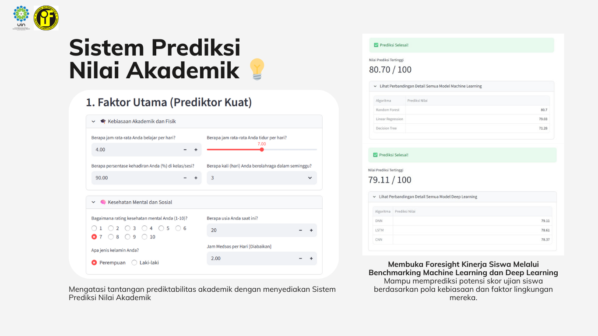
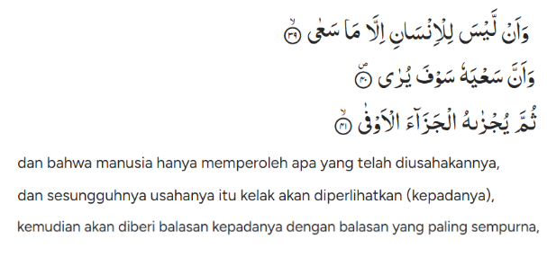

[Paper]()

[Machine Learning](https://colab.research.google.com/drive/1ZtjwKgPFdE6cZ7iPvKhF3kLMKFEpIRC_?usp=sharing) - [Deep Learning](https://colab.research.google.com/drive/1P_c-LwpLDDR5-cfjo8N1zliXrdzly8hS?usp=sharing)
# Sistem Prediksi Nilai Akademik 💡

Proyek ini bertujuan untuk mengatasi tantangan prediktabilitas akademik dengan menyediakan Sistem Prediksi Nilai Akademik. Menggunakan total enam algoritma (LSTM, CNN, DNN, Random Forest, Decision Tree, Linear Regression) untuk membandingkan hasil prediksi. Menyediakan perhitungan real-time dan akurat melalui semua modelnya.

## Topik dan Motivasi

Proyek ini bertindak sebagai alat modern untuk diperlihatkan kepada siswa *foresight* analitis, memungkinkan siswa melihat secara live bagaimana setiap jam belajar, kehadiran, atau peningkatan kesehatan mental (usaha seberat zarrah) akan dihitung dan menghasilkan balasan yang paling sempurna (nilai terbaik) dalam ujian. Tujuannya adalah menginspirasi motivasi berbasis data, bukan sekadar memprediksi, melainkan mendorong perbaikan diri berkelanjutan.

<h5>An-Najm:39-41</h5>

## Teknologi yang Digunakan

- [Python](https://www.python.org/)
- [Deep Learning](https://www.tensorflow.org/guide/keras)
- [Machine Learning](https://scikit-learn.org/stable/)
- [Streamlit](https://streamlit.io/)
- [Dataset](student_habits_performance.csv)

## Team Kami
- Ismail Muhammad Ahmadi (1227050062)
- Mochammad Khaerul Ilman	(1227050073)
- Nada Fadhiilah Balqis	(1217050107)
- Nazwa Revalina Azzahra Djuarsah	(1227050104)
- Retno Nissa Salsabillah	(1227050114)

---

## Referensi

Kami menyediakan daftar artikel jurnal, makalah konferensi, dan sumber daya lain yang telah menginspirasi proyek kami:

1. Y. Lin, H. Chen, W. Xia, F. Lin, Z. Wang, and Y. Liu, “A Comprehensive Survey on Deep Learning Techniques in Educational Data Mining,” Data Sci Eng, Jul. 2025, doi: 10.1007/s41019-025-00303-z.
2. Ordoñez-Avila, J. Meza, and S. Ventura, “Mining autonomous student patterns score on LMS within online higher education,” PeerJ Comput Sci, vol. 11, 2025, doi: 10.7717/peerj-cs.2855.
3. F. T. Johora, M. N. Hasan, A. Rajbongshi, M. Ashrafuzzaman, and F. Akter, “An explainable AI-based approach for predicting undergraduate students academic performance,” Array, vol. 26, p. 100384, Jul. 2025, doi: 10.1016/j.array.2025.100384.
4. E. Ahmad Zaki Hamidi et al., “Prediksi Semester Tugas Akhir Mahasiswa Berdasarkan Transkrip Nilai Menggunakan Linear Regression, Kernel Ridge Regression dan Decision Tree Regression (Eki Ahmad Zaki Hamidi, Edi Mulyana, Dilla Restu Agusthiani, Aldi Fahruzi Muharam : Halaman 53-62) Prediksi Semester Tugas Akhir Mahasiswa Berdasarkan Transkrip Nilai Menggunakan Linear Regression, Kernel Ridge Regression dan Decision Tree Regression.”
5. J. S. Pedada, “Predicting test scores using random forest regression,” Aug. 27, 2025. doi: 10.21203/rs.3.rs-7455681/v1.
6. M. Sulehu, W. Wisda, F. Wanita, and M. Markani, “Optimasi Prediksi Kelulusan Mahasiswa Menggunakan Random Forest untuk Meningkatkan Tingkat Retensi,” Jurnal Minfo Polgan, vol. 13, no. 2, pp. 2364–2374, Jan. 2025, doi: 10.33395/jmp.v13i2.14472.
7. Sujan Devkota, “Student Result Prediction System using Linear Regression,” Journal of Business and Social Sciences, vol. 5, no. 1, pp. 49–54, Dec. 2023, doi: 10.3126/jbss.v5i1.72445.
8. F. Alshaikh and N. Hewahi, “Convolutional Neural Network for Predicting Student Academic Performance in Intelligent Tutoring System,” International Journal of Computing and Digital Systems, vol. 15, no. 1, pp. 239–258, Jan. 2024, doi: 10.12785/ijcds/150119.
9. L. Vives et al., “Prediction of Students’ Academic Performance in the Programming Fundamentals Course Using Long Short-Term Memory Neural Networks,” IEEE Access, vol. 12, pp. 5882–5898, 2024, doi: 10.1109/ACCESS.2024.3350169.
10. K. M and S. A. A. Raj, “Enhancing Student Performance Prediction Through Machine Learning and Deep Learning Models,” International Journal of Basic and Applied Sciences, vol. 14, no. 2, pp. 296–310, Jun. 2025, doi: 10.14419/88yz9489.
11. A. Nabil, M. Seyam, and A. Abou-Elfetouh, “Prediction of Students’ Academic Performance Based on Courses’ Grades Using Deep Neural Networks,” IEEE Access, vol. 9, pp. 140731–140746, 2021, doi: 10.1109/ACCESS.2021.3119596.
12. T. Tao, C. Sun, Z. Wu, J. Yang, and J. Wang, “Deep Neural Network-Based Prediction and Early Warning of Student Grades and Recommendations for Similar Learning Approaches,” Applied Sciences, vol. 12, no. 15, p. 7733, Aug. 2022, doi: 10.3390/app12157733.
13. A. S. Aljaloud et al., “A Deep Learning Model to Predict Student Learning Outcomes in LMS Using CNN and LSTM,” IEEE Access, vol. 10, pp. 85255–85265, 2022, doi: 10.1109/ACCESS.2022.3196784.
14. Riska Rismaya, Dwi Yuniarto, and David Setiadi, “Penerapan Algoritma Machine Learning dalam Prediksi Prestasi Akademik Mahasiswa,” Router : Jurnal Teknik Informatika dan Terapan, vol. 3, no. 1, pp. 15–23, Feb. 2025, doi: 10.62951/router.v3i1.389.
15. P. Kalyane, J. Damania, H. Patil, M. Wardule, and P. Shahane, “Student’s Performance Prediction using Decision Tree Regressor.” [Online]. Available: https://archive.ics.uci.edu/ml/datasets/student+performance.
16. M. I. Jordan and T. M. Mitchell, “Machine learning: Trends, perspectives, and prospects,” Science (1979), vol. 349, no. 6245, pp. 255–260, 2015.
17. Y. Lecun, Y. Bengio, and G. Hinton, “Deep learning,” Nature, vol. 521, no. 7553, pp. 436–444, 2015, doi: 10.1038/nature14539ï.
18. T. O. Hodson, T. M. Over, and S. S. Foks, “Mean Squared Error, Deconstructed,” J Adv Model Earth Syst, vol. 13, no. 12, Dec. 2021, doi: 10.1029/2021MS002681.
19. T. O. Hodson, “Root-mean-square error (RMSE) or mean absolute error (MAE): when to use them or not,” Jul. 19, 2022, Copernicus GmbH. doi: 10.5194/gmd-15-5481-2022.
20. J. Gao, “ R-Squared (R 2 ) – How much variation is explained? ,” Research Methods in Medicine & Health Sciences, vol. 5, no. 4, pp. 104–109, Sep. 2024, doi: 10.1177/26320843231186398. 
